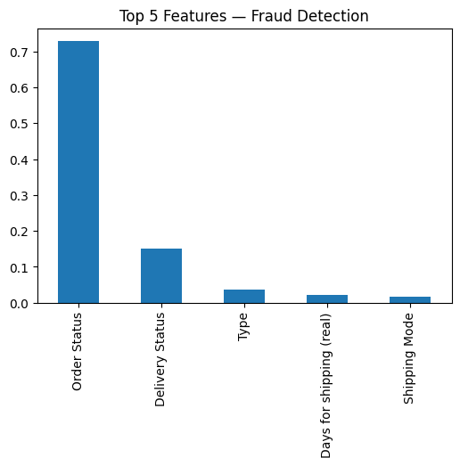
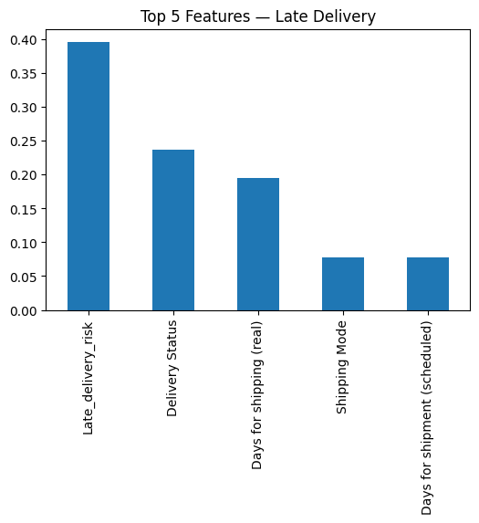

# MBS-Advanced-Statistics-ML-Supply-Chain
Machine learning models applied to supply chain fraud and late delivery prediction
# Advanced Statistics - Machine Learning for Supply Chain Analytics

This repository contains the complete work for the MBS Advanced Statistics assignment.
The objective is to apply machine learning models to detect fraudulent orders and predict late deliveries using the DataCoSupplyChain dataset.
---

## 📁 Repository Structure

📁 MBS-Advanced-Statistics-ML-Supply-Chain
│── Advanced_statistics.ipynb                  # Google Colab notebook
│── top5_fraud_detection.png                   # Top features for fraud detection
│── top5_late_delivery.png                     # Top features for late delivery
│── Advanced_Statistics_Assignment_2 (3).pdf   # Final academic report
│── README.md                                  # Documentation

---

## 🔍 Feature Importance Visualizations

The model analyses were complemented with two feature importance charts, showing the most influential variables for each prediction task.

### 1️⃣ Top 5 Features — Fraud Detection
This chart highlights the variables that contributed most strongly to detecting fraudulent transactions.  
These features typically include unusual timing behaviors, suspicious order patterns, inconsistent customer profiles, and anomalies in order processing.

---

### 2️⃣ Top 5 Features — Late Delivery Prediction
This chart shows the key drivers behind late deliveries, including delivery delays, geographic factors, shipping route complexity, and operational timing differences.

---

##  Machine Learning Models Used

- Logistic Regression (baseline)
- Random Forest Classifier (best model)

The dataset was cleaned, encoded, imputed (median), and split into 80/20 and 70/30.
Random Forest achieved **perfect performance** on both tasks.

---

## 📊 Final Evaluation Results

| Model               | Acc (Fraud) | Recall (Fraud) | F1 (Fraud) | Acc (Late) | Recall (Late) | F1 (Late) |
|--------------------|-------------|----------------|------------|------------|----------------|------------|
| Logistic Regression | 0.976457    | 0.0            | 0.0        | 0.548333   | 1.0            | 0.708288   |
| Random Forest       | 1.000000    | 1.0            | 1.0        | 1.000000   | 1.0            | 1.0        |

---

##  Key Insights

- Logistic Regression failed to detect fraud.
- Random Forest provided perfect classification and is recommended for supply chain analytics.
- Feature importance analysis shows that delivery timing, shipping delays, and abnormal patterns are critical predictors.

---

## 📝 Author
**Houssam Tachihante**  

